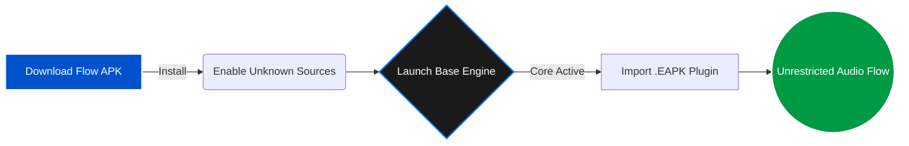

<!-- HEADER BANNER -->

<!-- APP LOGO -->
<!-- Replace 'icon.png' with the actual path to your blue icon file inside your repository -->

# 🎵 FLOW MUSIC PLAYER
### *Redefining Android Audio Architecture with Modular Power.*

  
  
  
  

<h4>
  <a href="#-the-flow-experience">Experience</a> • 
  <a href="#-supported-platforms">Platforms</a> • 
  <a href="#-installation-terminal">Installation</a> • 
  <a href="#-modular-architecture">Architecture</a>
</h4>

---

## ✨ The Flow Experience

Flow isn't just a music player; it is a highly scalable audio engine built on a modular framework. By decoupling the core playback engine from music sources, Flow allows you to inject custom `.eapk` modules to stream, download, and manage audio from anywhere.

| 🧩 **True Modularity** | ⚡ **Lightweight & Fast** |
| :--- | :--- |
| Inject custom `.eapk` plugins to expand functionality instantly without updating the core app. | Written for modern Android devices, ensuring zero bloat, fast startup times, and smooth animations. |
| 🎨 **Dynamic UI** | 🛡️ **Total Privacy** |
| A highly polished interface that adapts to your music, offering a premium listening experience. | No hidden trackers. Flow plays your music, your way, on your device. |

---

## 🌐 Supported Platforms

Flow's modular `.eapk` framework currently supports seamless integration with the following media servers and streaming platforms:

  
  
  
  
  

  <i>More platforms can be added dynamically by importing new extension modules!</i>

---

## 🚀 Installation Terminal

Follow this procedural pipeline to establish your localized Flow installation environment.

### 🔹 Phase 1: Deploy Core Application Engine

1. Access the master distribution vault via the **[Flow Releases Page](https://github.com/Garvittt-API/Flow-releases/releases)**.
2. Initialize execution on your target device by downloading the latest system `.apk` asset.
3. Permit system authorization overrides if prompted (*"Allow installation from Unknown Sources"*).
4. Run the installer script, execute file unpacking, and launch **Flow**.

### 🔹 Phase 2: Inject Driver Extensions

1. Capture your preferred plugin module from the official **[Flow Extensions Vault](https://github.com/Garvittt-API/Flow-extension/releases/tag/extension)**.
2. Fire up Flow ➔ Locate and trigger the Control Action button in the **Top Right Corner**.
3. It will open the **'Music Extensions'** hub.
4. Press the **Add (+)** utility button and click on the **File** selection criteria option.
5. Choose your downloaded `.eapk` module asset inside the Android Storage File Tree wrapper to hot-load the music framework instantly.

---

## 🏗️ Modular Architecture

Flow utilizes a unique **Core-to-Plugin** bridge design:

* **The Engine (Core):** Handles UI rendering, media session management, audio focus, and background playback.
* **The Nodes (.eapk):** Isolated plugin binaries that act as content resolvers. They scrape, fetch, and deliver audio metadata and streams back to the core.

> **Why this matters:** If a music source breaks or changes its API, you don't need to wait for a full app update. Just swap or update the specific `.eapk` extension!

---

## 🔗 Project Ecosystem

Navigate the Flow architecture repositories here:

* ⚙️ **System Master Engine:** [Garvittt-API/Flow-releases](https://www.google.com/search?q=https://github.com/Garvittt-API/Flow-releases) *(Core Application)*
* 🔌 **Plugin Integration Matrix:** [Garvittt-API/Flow-extension](https://github.com/Garvittt-API/Flow-extension) *(.eapk Modules)*

---

## 📬 Maintenance & Support Protocol

Encountered an optimization flaw or have a structural suggestion to present? Flow thrives on community debugging and feature requests.

* **Bug Reports & Features:** File an analytical operational report directly inside the repository's **Issues Tracker**.
* **Direct Comm-Link:** Connect via formal transmission pipelines at **[garvitchoudhary2315@gmail.com](https://www.google.com/search?q=mailto%3Agarvitchoudhary2315%40gmail.com)**.
